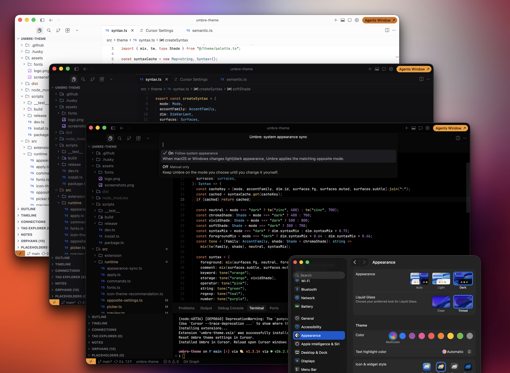

  

<h1 align="center">Umbre</h1>

  A quiet theme for VS Code and Cursor.

  <strong>Dark and light themes with simple built-in customization.</strong>

  

---

Umbre is one calm theme you can shape from the Command Palette.

No copied JSON. No color overrides. Pick a preset, tune what you want, and Umbre writes its own generated theme files for you.

Umbre commands are always available from the Command Palette and guide you if the theme is not active yet.

## Start here

1. Install Umbre from the [Visual Studio Marketplace](https://marketplace.visualstudio.com/items?itemName=ohkimur.umbre-theme) or [Open VSX](https://open-vsx.org/extension/ohkimur/umbre-theme).
2. Run **Preferences: Color Theme**.
3. Choose **Umbre**.
4. Choose a preset or configure the theme yourself from the setup picker.

## Recommended settings

Three polished starting points are built in:

- **Light** — soft, bright, and easy for daytime work.
- **Balanced** — the default Umbre feel.
- **Pure black** — true black for very dark rooms and OLED displays.

Choosing a preset gives you a stable fixed setup. Turn on **System appearance sync** separately when you want Umbre to follow your OS.

## What you can tune

Run **Umbre: Configure Theme** and choose exactly what you want:

- **Configure all** — walk through every option.
- **Recommended presets** — pick Light, Balanced, or Pure black.
- **Mode** — switch between dark and light.
- **Surface shade** — choose a softer or deeper editor background.
- **Accent color** — change the command, cursor, focus, badge, and active color.
- **Editor dimming** — make syntax vivid, balanced, soft, muted, or faint.
- **Panel contrast** — blend or separate sidebars, panels, tabs, and widgets.
- **Terminal contrast** — tune the terminal background separately.
- **Border intensity** — hide separators or make the workspace structure clearer.
- **System appearance sync** — follow macOS or Windows light/dark appearance.
- **Recommended font** — preview and choose JetBrains Mono, Fira Code, or Hack Nerd Font.

Changes preview while you choose. Applying a theme keeps your editor settings clean, except when you explicitly apply a recommended font.

## Commands

- **Umbre: Configure Theme** — configure presets, mode, shade, accent, syntax, panels, terminal, borders, sync, and fonts.
- **Umbre: Toggle Opposite Mode** — jump to the matching light/dark opposite of your current setup.
- **Umbre: Choose Font** — preview and choose a recommended coding font.

## Nice pairing

Umbre pairs well with [Symbols](https://marketplace.visualstudio.com/items?itemName=miguelsolorio.symbols), a simple file icon theme for VS Code and Cursor.

After you finish Umbre setup, Umbre can help install Symbols and apply it when you choose **Use Symbols**.
