# Umbre Markdown visual fixture

Expand one group at a time. Compare source, built-in preview, rich Markdown Editor, and optional GitHub preview. Start with pure black, then light; check quiet spacing, legible colors, and restrained borders. Remote images and parser-dependent features intentionally expose renderer differences.

<details open>
<summary>Simple</summary>

Look for readable essentials, consistent typography, and calm default diagrams.

<!-- Look for comment markers in source, and no visible comment in rendered views. -->

# Umbre Markdown stress

Look for parity across source, built-in preview, rich editor, and optional GitHub preview. Check pure black, charcoal, paper white, shadow light, every syntax scheme, and hidden/strong borders. Parser-dependent features deliberately reveal differences; unsupported math, footnotes, alerts, or diagrams should remain readable.

# Heading one
## Heading two immediately after one
### Heading three immediately after two
#### Heading four
##### Heading five
###### Heading six — muted must still read

Setext heading one
==================

Setext heading two
------------------

## A very long heading that wraps across several lines in a narrow editor pane and contains **strong emphasis**, _italic emphasis_, `inlineCode<T>()`, a [link](https://example.com), and punctuation — / : ? ! ( ) [ ] { }

Look for wrapping, heading separators, rhythm, and no collision between consecutive headings.

## Inline sampler

Plain **bold** __also bold__ *italic* _also italic_ ***bold italic*** ___also both___ ~~struck out~~ **bold with _nested italic_ and `code`**. `inlineCode({ value: 42 })` and ``code with `backticks` inside`` and ```two `` backticks``` and ` spaces ` and `a|b <tag> & x`.

[Normal link](https://example.com "A title") · [reference link][ref] · [collapsed][] · [shortcut] · <https://example.com/autolink?q=one&two=3> · <qa@example.com> · https://example.com/bare/path?q=a · www.example.com · [**bold link with `code`**](https://example.com).

Footnote one[^one], another[^multi], Unicode 👩🏽‍💻 🧊 🔥 ⚠️ ✅ → ∑ 中文 العربية é, and shortcodes :smile: :warning: :rocket: :+1: :not_a_real_emoji:.

<kbd>⌘</kbd> + <kbd>Shift</kbd> + <kbd>P</kbd>, <mark>highlighted words with **literal Markdown?**</mark>, H<sub>2</sub>O, x<sup>2</sup>, <small>small text</small>, <abbr title="Accessible Rich Internet Applications">ARIA</abbr>, and a forced<br>line break.

Two trailing spaces force a break here.  
This is the following line.

Backslash hard break here.\
This is the following line.

Escapes: \*not italic\* \_not italic\_ \#not a heading \[not a link\] \| pipe \\ backslash. Entities: &amp; &lt; &gt; &quot; &copy; &nbsp;end.

 

[](https://example.com)

[ref]: https://example.com/reference "Reference title"
[collapsed]: https://example.com/collapsed
[shortcut]: https://example.com/shortcut

[^one]: A short footnote with `code` and a [link](https://example.com).
[^multi]: First footnote paragraph.

    Second footnote paragraph with **bold**.

    - A footnote list item.


## Simple Mermaid — no custom styling

Look for default colors, readable labels, restrained fills, and unbroken arrows across every diagram family.

### Flowchart

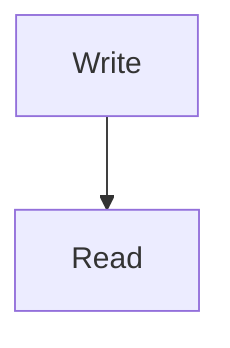

### Sequence

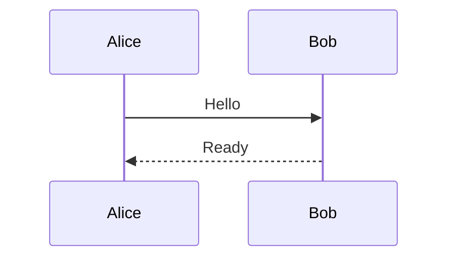

### Class

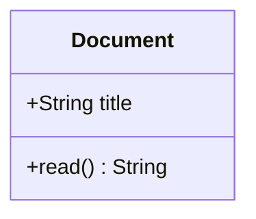

### State

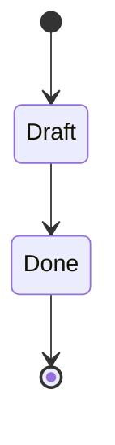

### ER

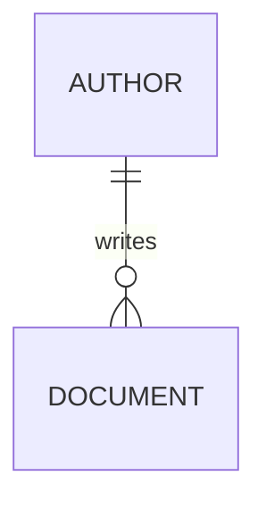

### Gantt

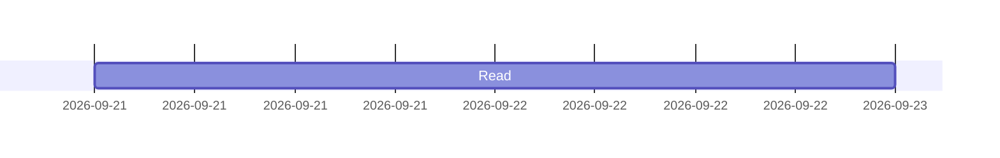

### Pie

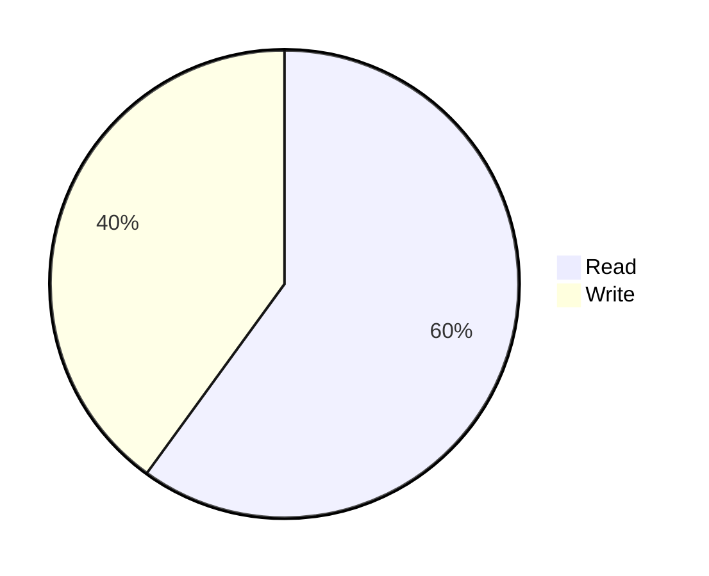

### Journey

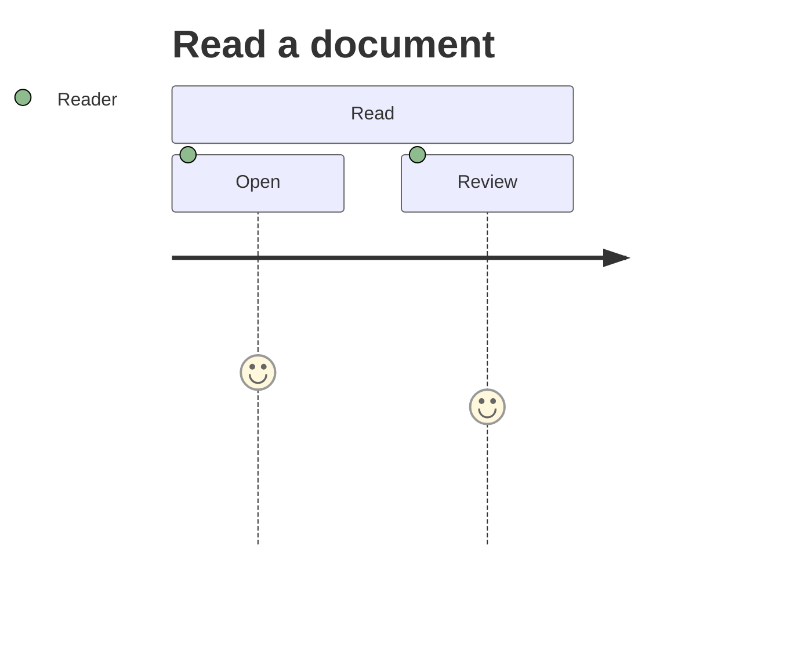

### Git graph

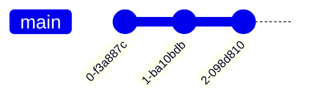

### Mindmap

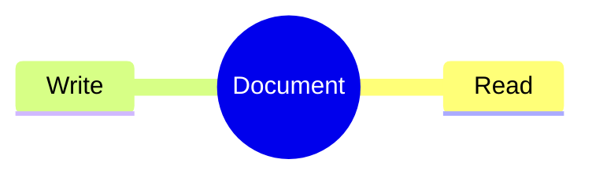

### Timeline

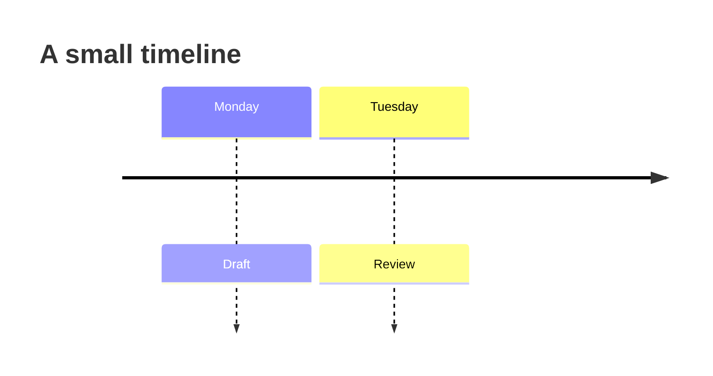

### Quadrant

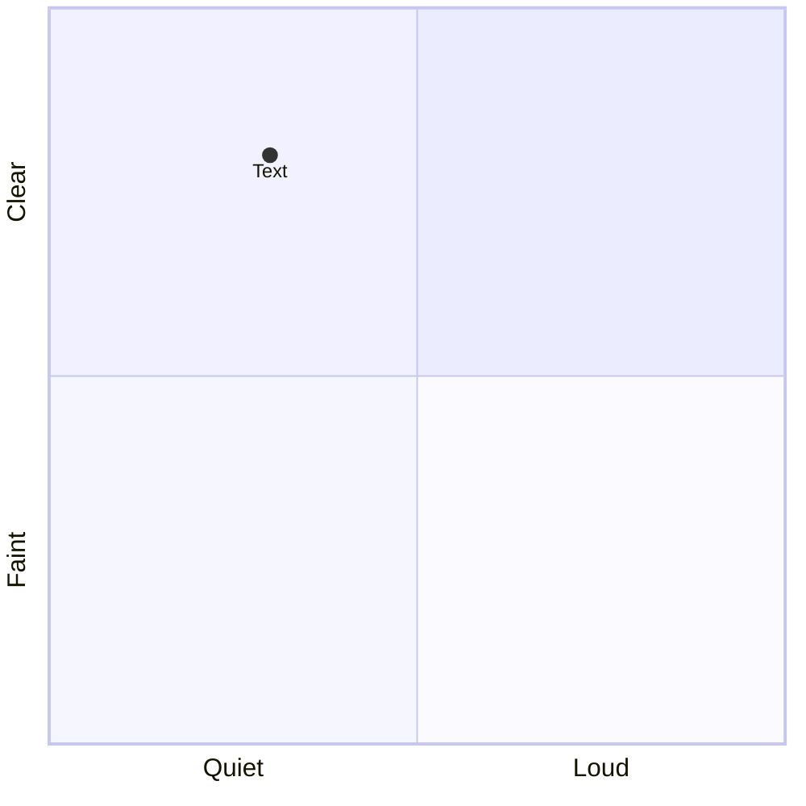

</details>

<details>
<summary>Medium</summary>

Look for nesting, spacing, alignment, code token parity, and readable diagram relationships.

## Lists — look for markers, indentation, and rhythm

- Tight one
- Tight two
  1. Ordered depth two
     - Unordered depth three
       1. Ordered depth four
          - Unordered depth five with `inline code`
          - Another fifth-level item
       2. Another fourth-level item
     - Another third-level item
  2. Another second-level item
- Tight final

1. Ordered level one
   1. Ordered level two
      1. Ordered level three
         1. Ordered level four
            1. Ordered level five
            2. A long final item that should wrap with its text aligned beneath its content rather than beneath its numeric marker.
2. End

97. Large start value
98. Next
99. Next
100. Three digits

- Loose item with paragraph one.

  Paragraph two with **bold**, a link, and `code`.

- Loose item with block content:

  ```ts
  const nested = { list: true, count: 42 };
  ```

  > A quote inside a list.
  >
  > Another quoted paragraph.

  | Nested header | Value |
  | :--- | ---: |
  | `code` | 42 |
  | [link](https://example.com) | 0 |

- Final loose item.

- [ ] Unchecked task
- [x] Checked task with ~~completed wording~~
- [X] Uppercase checked task
  - [ ] Nested unchecked
    - [x] Third-level checked
      - [ ] Fourth-level task
        - [x] Fifth-level task
- [ ] Task with two paragraphs.

  This paragraph belongs to the task.

## Quotes — look for nesting, rails, padding, and contrast

> First-level quote with **strong** and `code`.
>
> > Second-level quote.
> >
> > > Third-level quote with a [link](https://example.com).
> > >
> > > - Deep list
> > > - Second item
> > >
> > > ```python
> > > print("quoted code")
> > > ```
> > >
> > > | Key | Value |
> > > | --- | --- |
> > > | deep | readable |
>
> Back to level one.
>
> 1. Ordered quoted item
> 2. Another quoted item

> [!NOTE]
> A note with `code`, **bold**, and [a link](https://example.com).
>
> Second paragraph of the note; the rail should continue.
>
> - Note list item
> - Another item

> [!TIP]
> A useful tip.
>
> ```ts
> const tip = "keep contrast";
> ```

> [!IMPORTANT]
> Important content should be distinct from a normal quote.
>
> A second important paragraph.

> [!WARNING]
> Warning text with **emphasis** and `dangerousLookingCode()`.
>
> | Risk | Mitigation |
> | --- | --- |
> | Low contrast | Check light and dark |

> [!CAUTION]
> Caution text must remain readable against every surface.
>
> > Nested quote inside caution.

> Quoted Mermaid: source highlighting must match a top-level fence.
>
> ```mermaid
> flowchart TD
>   A[Quoted start] --> B{Decision}
>   B -->|yes| C[Done]
>   style C stroke-width:2px
> ```

## Tables — alignment, single header band, stripes, overflow
| Left | Center | Right | Default |
| :--- | :---: | ---: | --- |
| short | middle | 12.34 | ordinary |
| **strong** | `inlineCode()` | -999 | [link](https://example.com) |
| escaped \| pipe | a\|b | 0 | ~~strike~~ |
| | empty neighbors | | |
| This is a very long cell containing several words that should wrap without widening the entire view beyond reasonable bounds | **center** | 1234567890 | End |

| Immediately adjacent table | Second |
| --- | --- |
| new header | new body |

### One column
| Only column |
| --- |
| one |
| `two` |
| |

### Header only
| Header A | Header B |
| --- | --- |

### Wide table — horizontal overflow, 14 columns
| C01 | C02 | C03 | C04 | C05 | C06 | C07 | C08 | C09 | C10 | C11 | C12 | C13 | C14 |
| :--- | :---: | ---: | --- | --- | --- | --- | --- | --- | --- | --- | --- | --- | --- |
| alpha | beta | 42 | delta | epsilon | zeta | eta | theta | iota | kappa | lambda | mu | nu | xi |
| `code` | [link](https://example.com) | -1 | **bold** | _italic_ | ~~strike~~ | a\|b | | 👩🏽‍💻 | 中文 | &amp; | end | long-long-long-long | final |
| third | third | 3 | third | third | third | third | third | third | third | third | third | third | third |

## Code — compare token roles with source and embedded editors

### TypeScript
```ts
// Comment and documentation contrast
/** @param input Unicode, nullability, generics. */
export interface Box<T extends string = string> { readonly value?: T; count: number }
const text: string = "hello";
const regexp = /(?<word>\w+)\s+/giu;
export async function inspect<T>(input: Box<string>): Promise<T | null> {
  const { value = `fallback-${42}`, count } = input;
  if (value && count >= 0) console.log({ value, count, enabled: true, nothing: null });
  return await Promise.resolve(null);
}
```

### TSX
```tsx
import { useState } from "react";
type Props = { title: string; children?: React.ReactNode };
export function Card({ title, children }: Props) {
  const [open, setOpen] = useState(false);
  return <section aria-label={title} data-open={open}>
    <button onClick={() => setOpen(v => !v)}>{open ? "Hide" : "Show"}</button>
    {open && <div className="body">{children}</div>}
  </section>;
}
```

### JavaScript
```js
class Example extends Map {
  #private = 42;
  async run({ value = "default" } = {}) {
    const result = /foo+/gi.test(value) ? `${value}: ${this.#private}` : null;
    return await Promise.resolve(result);
  }
}
```

### JSON
```json
{"name":"umbre","enabled":true,"nothing":null,"number":-12.34e+5,"items":[1,2,"three"],"escaped":"a\nb\t\"c\""}
```

### JSONC
```jsonc
{
  // A comment must remain distinct from values.
  "enabled": true,
  "settings": { "syntax": "Frost", },
}
```

### YAML
```yaml
# Anchors, aliases, and block strings
base: &base
  enabled: true
  count: 42
copy:
  <<: *base
  message: |
    first line
    second line
folded: >-
  long text
  folded together
items: [null, false, "string"]
```

### TOML
```toml
# Comment
name = "umbre"
enabled = true
[theme]
shade = 5
modes = ["dark", "light"]
[[items]]
id = 42
when = 2026-09-21T12:00:00Z
```

### Bash and tree listing
```bash
#!/usr/bin/env bash
set -euo pipefail
label="Umbre"
printf '%s\n' "$label"
for item in "one two" three; do
  echo "${item:-fallback}" | sed 's/o/O/g'
done
cat <<'TREE'
packages/
├── app/
│   ├── index.ts
│   └── README.md
└── tests/
    └── sample.test.ts
TREE
```

### Standalone tree listing
```text
workspace/
├── src/            # source
│   ├── index.ts
│   └── utils/
│       └── format.ts
├── docs/
│   └── guide.md
└── package.json
```

### Python
```python
from dataclasses import dataclass
@dataclass(frozen=True)
class Item:
    name: str
    count: int = 42
async def inspect(item: Item) -> str | None:
    # Unicode and interpolation
    return f"{item.name!r}: {item.count:04d} → 🧊" if item.count else None
```

### Rust
```rust
use std::collections::HashMap;
#[derive(Debug, Clone)]
struct Item<'a> { name: &'a str, count: usize }
fn inspect<'a>(item: &'a Item<'a>) -> Result<&'a str, String> {
    match item.count { 0 => Err("empty".into()), _ => Ok(item.name) }
}
```

### Go
```go
package main
import "fmt"
type Item struct { Name string; Count int }
func main() {
    values := []Item{{Name: "Umbre", Count: 42}}
    for _, value := range values { fmt.Printf("%s: %d\n", value.Name, value.Count) }
}
```

### CSS
```css
:root { --surface: Canvas; --ink: CanvasText; }
@media (prefers-color-scheme: dark) {
  .card:is(:hover, :focus-visible) > a[href]::after {
    content: " →";
    color: var(--ink);
    background: color-mix(in srgb, currentColor 10%, transparent);
    padding: calc(1rem + 2px);
  }
}
```

### HTML
```html
<!doctype html>
<html lang="en">
  <body>
    <!-- HTML comment -->
    <button disabled aria-label="A &amp; B">Hello <strong>world</strong></button>
    <input type="checkbox" checked />
    <script type="application/json">{"safe":"data"}</script>
  </body>
</html>
```

### SQL
```sql
-- Comment
WITH totals AS (
  SELECT user_id, COUNT(*) AS total FROM events
  WHERE created_at >= CURRENT_DATE - INTERVAL '7 days'
  GROUP BY user_id
)
SELECT u.name, COALESCE(t.total, 0) AS total
FROM users u LEFT JOIN totals t ON t.user_id = u.id
ORDER BY total DESC LIMIT 10;
```

### Diff
```diff
diff --git a/theme.ts b/theme.ts
--- a/theme.ts
+++ b/theme.ts
@@ -1,3 +1,3 @@
-const shade = "charcoal";
+const shade = "pure black";
 const shared = true;
```

### Dockerfile
```dockerfile
FROM node:22-alpine AS build
WORKDIR /app
COPY package*.json ./
RUN npm ci --ignore-scripts
COPY . .
ENV NODE_ENV=production
USER node
CMD ["node", "index.js"]
```

### GraphQL
```graphql
query Find($id: ID!, $include: Boolean! = true) {
  user(id: $id) { ...Identity posts @include(if: $include) { title } }
}
fragment Identity on User { id name }
```

### Markdown inside four-backtick fence
````markdown
# Nested heading

> [!NOTE]
> Literal Markdown source.

```ts
const nestedFence = true;
```

~~~text
Tilde fence inside a backtick fence.
~~~
````

### Tilde fence with embedded backticks
~~~~markdown
```js
console.log("inner fence");
```
~~~
A shorter tilde fence is still literal here.
~~~
~~~~

### Plaintext
```plaintext
Plain text must not become an accent-colored wall.
┌──────────┬──────────┐
│ Column A │ Column B │
├──────────┼──────────┤
│ α β γ    │ 中文 🧊  │
└──────────┴──────────┘
```

### No language
```
plain unclassified content { [ ] } <tag> "string" 42
spaces    aligned    columns
```

### Indented code

    Indented plain code should match fenced plain code.
    const notNecessarilyJavaScript = "literal";
    ├── child
    └── last

### Unknown language
```umbre-unknown-language
unknown syntax should degrade gracefully, not disappear
```

## Horizontal rules — compare all three spellings

Above asterisk rule.

***

Above hyphen rule.

---

Above underscore rule.

___

## HTML and disclosure blocks

<details>
<summary>Collapsed details with <code>inlineCode()</code> and <strong>strong</strong></summary>

### Nested heading in details

A paragraph with a [link](https://example.com).

- Nested list
  - Deeper item

| Key | Value |
| --- | --- |
| `code` | **bold** |

```ts
const insideDetails = true;
```

<details>
<summary>Second nested disclosure</summary>

> A quote inside nested details.

</details>
</details>

<details open>
<summary>Initially open disclosure</summary>

Look for correct spacing below the summary and no clipped borders.

</details>

<dl>
<dt>Term one</dt>
<dd>A definition with <code>code</code>, <strong>strong</strong>, and a <a href="https://example.com">link</a>.</dd>
<dt>Term two</dt>
<dd>First definition paragraph.<p>Second definition paragraph.</p></dd>
</dl>

<div align="center">
<p><strong>Centered raw HTML block</strong></p>
<p><code>inline HTML code</code> and <em>emphasis</em>.</p>
</div>

<!-- Multiline comment:
# This must not render as a heading.
| A | B |
-->

## Math — parser support, baseline, and overflow

Inline math $E = mc^2$, $x_i^2 + y_i^2$, and a literal amount $5 next to $10. Literal requested delimiter text: 68935.

$$
\int_{-\infty}^{\infty} e^{-x^2}\,dx = \sqrt{\pi}
$$

$$
\begin{aligned}
a_n &= \sum_{k=0}^{n} \binom{n}{k} x^k y^{n-k} \\
M &= \begin{pmatrix} 1 & 2 \\ 3 & 4 \end{pmatrix}
\end{aligned}
$$


## Medium Mermaid — grouped and connected

Look for default colors, readable labels, restrained fills, and unbroken arrows across every diagram family.

### Flowchart

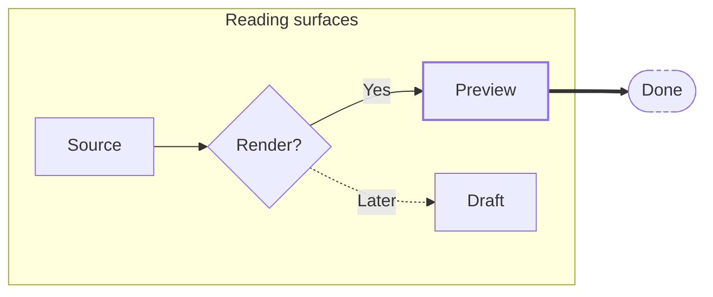

### Sequence

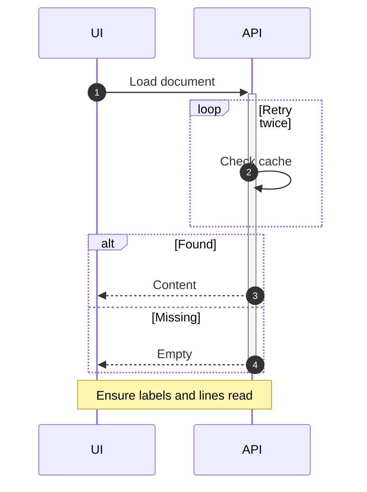

### Class

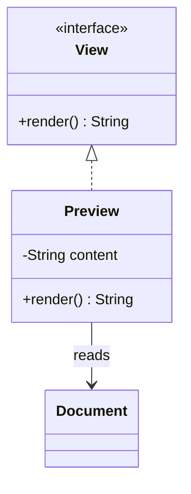

### State

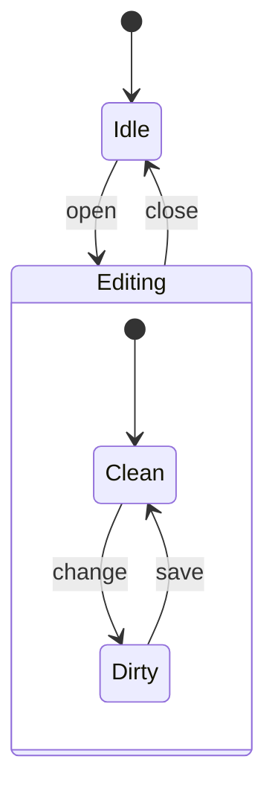

### ER

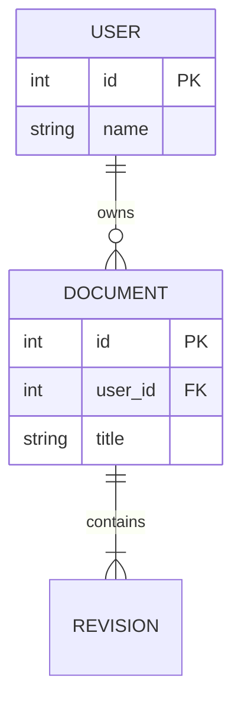

### Gantt

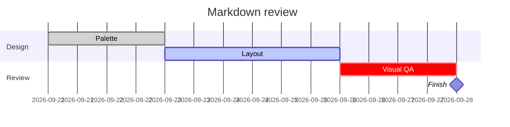

### Pie

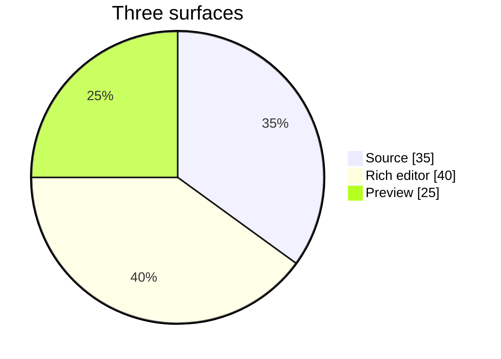

### Journey

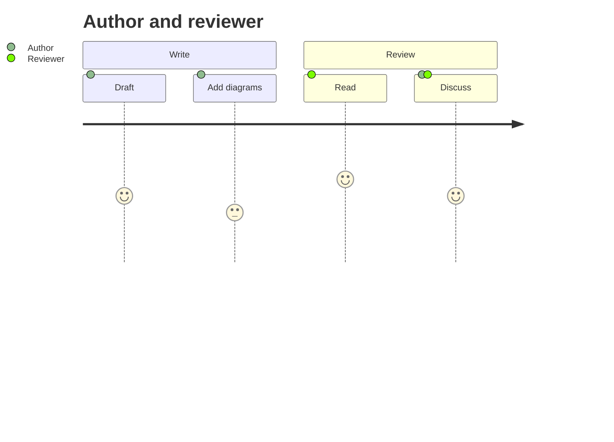

### Git graph

```mermaid
gitGraph
  commit id: "start"
  branch feature
  commit id: "styles"
  checkout main
  commit id: "docs"
  merge feature tag: "review"
```

### Mindmap

```mermaid
mindmap
  root((Theme))
    Dark
      Charcoal
      Black
    Light
      Paper
      Shadow
    Syntax
      Ember
      Flare
      Frost
```

### Timeline

```mermaid
timeline
  title Review cycle
  section Create
    Day 1 : Draft : Palette
    Day 2 : CSS
  section Review
    Day 3 : Dark mode : Light mode
    Day 4 : Fixes
```

### Quadrant

```mermaid
quadrantChart
  title Compare surfaces
  x-axis Minimal --> Busy
  y-axis Low contrast --> High contrast
  quadrant-1 Loud
  quadrant-2 Calm
  quadrant-3 Faint
  quadrant-4 Cluttered
  Source: [0.25, 0.75]
  Preview: [0.5, 0.8]
  Editor: [0.35, 0.7]
```

</details>

<details>
<summary>Complex</summary>

Look for overflow, crowding, author-style preservation, deep nesting, and diagram-family coverage.

## Mermaid — default palette first, no author colors

Look for readable labels, arrowheads, edge strokes, and group backgrounds in pure black and light mode. This diagram deliberately has no classDef or style overrides.

```mermaid
flowchart TD
  Start([Start]) --> Choice{Ready?}
  Choice -->|Yes| Work[Process]
  Choice -.->|No| Wait((Wait))
  Wait --> Choice
  Work ==> Done([Done])
```

### Flowchart LR — nested groups, classic node shapes, styling

```mermaid
%%{init: {"flowchart": {"curve": "linear"}}}%%
flowchart LR
  %% Comments should be quiet in source.
  subgraph outer[Outer group]
    subgraph middle[Middle group]
      subgraph inner[Inner group]
        A[Rectangle] --> B(Rounded)
        B --> C([Stadium])
      end
      C --> D[[Subroutine]]
      D --> E[(Database)]
    end
    E --> F((Circle))
    F --> G>Asymmetric]
  end
  G --> H{Diamond}
  H -. dotted .-> I{{Hexagon}}
  I == thick ==> J[/Parallelogram/]
  J --> K[\Reverse parallelogram\]
  K --> L[/Trapezoid\]
  L --> M[\Reverse trapezoid/]
  M --> N(((Double circle)))
  A --- O[No arrow]
  A -- Label --> P[Labelled]
  A o--o Q[Circle endpoints]
  A x--x R[Cross endpoints]
  A <--> S[Bidirectional]
  classDef highlighted stroke-width:3px,stroke-dasharray:5 3
  class B,D highlighted
  style H stroke-width:3px
  linkStyle 0 stroke-width:3px
  click P "https://example.com" "External example link"
```

### Expanded flowchart shapes — support depends on Mermaid version

```mermaid
flowchart TD
  a@{ shape: rect, label: "Process" } --> b@{ shape: rounded, label: "Event" }
  b --> c@{ shape: stadium, label: "Terminal" }
  c --> d@{ shape: subproc, label: "Subprocess" }
  d --> e@{ shape: cyl, label: "Database" }
  e --> f@{ shape: circle, label: "Circle" }
  f --> g@{ shape: dbl-circ, label: "Double circle" }
  g --> h@{ shape: diamond, label: "Decision" }
  h --> i@{ shape: hex, label: "Prepare" }
  i --> j@{ shape: lean-r, label: "Input" }
  j --> k@{ shape: lean-l, label: "Output" }
  k --> l@{ shape: trap-b, label: "Manual operation" }
  l --> m@{ shape: trap-t, label: "Manual input" }
  m --> n@{ shape: doc, label: "Document" }
  n --> o@{ shape: docs, label: "Documents" }
  o --> p@{ shape: notch-rect, label: "Card" }
  p --> q@{ shape: bow-rect, label: "Stored data" }
  q --> r@{ shape: fr-rect, label: "Framed process" }
  r --> s@{ shape: divided-rect, label: "Divided process" }
  s --> t@{ shape: delay, label: "Delay" }
  t --> u@{ shape: hourglass, label: "Collate" }
  u --> v@{ shape: bolt, label: "Communication" }
  v --> w@{ shape: cloud, label: "Cloud" }
  w --> x@{ shape: text, label: "Text only" }
  x --> y@{ shape: tri, label: "Extract" }
  y --> z@{ shape: flag, label: "Paper tape" }
```

### Sequence — arrows, activation, notes, highlights, branches

```mermaid
sequenceDiagram
  autonumber
  actor User
  participant UI as Interface
  participant API as Service
  participant DB as Database
  User->>+UI: Open document
  UI->>+API: Fetch metadata
  rect rgba(127, 127, 127, 0.12)
    Note over UI,API: Highlighted region — check label contrast
    loop Until ready
      API->>DB: Read status
      DB-->>API: Status
    end
  end
  alt Success
    par Load content
      API->>DB: Content query
      DB-->>API: Content
    and Load permissions
      API->>DB: Access query
      DB-->>API: Permissions
    end
    API-->>-UI: Result
  else Missing
    API-->>UI: Not found
  end
  Note right of UI: A note with<br/>two lines
  UI-->>-User: Render view
  User->UI: Open arrow
  UI-->API: Dashed open arrow
  API-)DB: Async message
  DB--)API: Async response
  API-xUI: Cross endpoint
  UI--xUser: Dashed cross endpoint
```

### Class diagram — generics, members, relationships

```mermaid
classDiagram
  class Repository~T~ {
    <<interface>>
    +find(id: String) T
    +save(value: T) bool
  }
  class Item {
    +String name
    -int count
    #validate() bool
    +create() Item$
  }
  class Store {
    -List~Item~ items
    +find(id: String) Item
  }
  class Base
  class Owner
  class Part
  class Observer
  Base <|-- Store : inherits
  Repository <|.. Store : implements
  Owner *-- Part : composition
  Owner o-- Item : aggregation
  Store --> Item : association
  Observer ..> Store : dependency
  Owner "1" -- "many" Item : owns
  note for Item "Readable member names and separators"
```

### State diagram — composite and concurrent states

```mermaid
stateDiagram-v2
  [*] --> Idle
  Idle --> Running: start
  state Running {
    state Worker {
      [*] --> Loading
      Loading --> Ready
      Ready --> [*]
    }
    --
    state Monitor {
      [*] --> Watching
      Watching --> Reporting
      Reporting --> [*]
    }
  }
  Running --> Done: finish
  Done --> [*]
  note right of Running
    Composite state with parallel regions.
  end note
```

### ER diagram — all cardinalities and attribute roles

```mermaid
erDiagram
  CUSTOMER ||--o{ ORDER : places
  ORDER ||--|{ LINE_ITEM : contains
  PERSON ||--o| PASSPORT : holds
  TEAM }o--o{ PERSON : includes
  MANAGER }|--|{ TEAM : oversees
  OPTIONAL }o..o| SINGLE : relates
  CUSTOMER {
    int id PK
    string name "Display name"
    string email UK
  }
  ORDER {
    int id PK
    int customer_id FK
    date created_at
  }
  LINE_ITEM {
    int id PK
    int order_id FK
    decimal price
  }
```

### Gantt — dates, sections, milestones, critical and done

```mermaid
gantt
  title Theme rollout
  dateFormat YYYY-MM-DD
  axisFormat %b %d
  excludes weekends
  section Design
  Palette review :done, design, 2026-09-01, 3d
  Contrast checks :crit, contrast, after design, 4d
  section Delivery
  Visual QA :active, qa, after contrast, 5d
  Approval :milestone, approval, after qa, 0d
  Release :release, after approval, 2d
```

### Pie — labels and palette separation

```mermaid
pie showData
  title Markdown surface coverage
  "Rich editor" : 40
  "Built-in preview" : 35
  "Source view" : 20
  "Optional extensions" : 5
```

### Journey — actor colors and scores

```mermaid
journey
  title Configure a theme
  section Start
    Open picker: 5: Owner
    Choose shade: 4: Owner
  section Inspect
    Read table: 3: Owner, Reviewer
    Check diagrams: 2: Reviewer
    Restore preset: 5: Owner
```

### Git graph — branches, merges, tags

```mermaid
gitGraph
  commit id: "base"
  branch markdown
  checkout markdown
  commit id: "palette"
  commit id: "styles"
  checkout main
  commit id: "fix"
  merge markdown tag: "preview"
  commit id: "release" type: HIGHLIGHT
```

### Mindmap — indentation and shapes

```mermaid
mindmap
  root((Umbre))
    Surfaces
      Source
      Preview
      Rich editor
    Variants
      Dark
        Pure black
        Charcoal
      Light
        Paper
        Shadow
    QA
      Contrast
      Borders
      Syntax
```

### Timeline — grouped events

```mermaid
timeline
  title Markdown work
  section Design
    Monday : Shared palette : Source tokens
    Tuesday : Reading styles
  section Review
    Wednesday : Visual QA : Edge cases
    Thursday : Release review
```

### Quadrant chart — light fills and labels

```mermaid
quadrantChart
  title Readability and visual weight
  x-axis Quiet --> Loud
  y-axis Low contrast --> High contrast
  quadrant-1 Strong
  quadrant-2 Calm
  quadrant-3 Faint
  quadrant-4 Distracting
  Body text: [0.25, 0.80]
  Inline code: [0.45, 0.70]
  Borders: [0.20, 0.35]
  Alerts: [0.75, 0.85]
```

### Block diagram — layout and arrows

```mermaid
block-beta
  columns 3
  A["Source"] B["Palette"] C["Preview"]
  space D["Rich editor"] space
  A --> B
  B --> C
  B --> D
```

### C4 — actor, boundary, database

```mermaid
C4Context
  title Markdown ecosystem
  Person(reader, "Reader", "Reads and edits Markdown")
  System_Boundary(editor, "VS Code") {
    System(source, "Source editor", "TextMate tokens")
    System(preview, "Markdown preview", "Rendered document")
  }
  System_Ext(theme, "Umbre", "Shared colors")
  Rel(reader, source, "Edits")
  Rel(reader, preview, "Reads")
  Rel(theme, preview, "Themes")
```

## Final adjacency and empty-content checks

### Heading directly before quote
> Quote immediately below heading.

### Heading directly before fence
```text
Fence immediately below heading.
```

### Heading directly before table
| Header |
| --- |
| Body |

### Empty fenced block
```text
```

### Empty quote
>

### Empty list items
-
- content
-

### End — look for bottom spacing and horizontal scrolling

### Tabs and long code lines

```plaintext
Column A	Column B	Column C
	Indented by a literal tab
0123456789_abcdefghij_0123456789_abcdefghij_0123456789_abcdefghij_0123456789_abcdefghij_0123456789_abcdefghij_0123456789_abcdefghij_0123456789_abcdefghij_0123456789_abcdefghij_0123456789_abcdefghij_0123456789_abcdefghij_0123456789_abcdefghij_0123456789_abcdefghij_0123456789_abcdefghij_0123456789_abcdefghij_0123456789_abcdefghij_0123456789_abcdefghij_0123456789_abcdefghij_0123456789_abcdefghij_0123456789_abcdefghij_0123456789_abcdefghij_0123456789_abcdefghij_0123456789_abcdefghij_0123456789_abcdefghij_0123456789_abcdefghij_
```

### Unbroken prose and URL overflow

UnbrokenWordUnbrokenWordUnbrokenWordUnbrokenWordUnbrokenWordUnbrokenWordUnbrokenWordUnbrokenWordUnbrokenWordUnbrokenWordUnbrokenWordUnbrokenWordUnbrokenWordUnbrokenWordUnbrokenWordUnbrokenWordUnbrokenWordUnbrokenWordUnbrokenWordUnbrokenWordUnbrokenWordUnbrokenWordUnbrokenWordUnbrokenWordUnbrokenWordUnbrokenWordUnbrokenWordUnbrokenWordUnbrokenWordUnbrokenWordUnbrokenWordUnbrokenWordUnbrokenWordUnbrokenWordUnbrokenWordUnbrokenWordUnbrokenWordUnbrokenWordUnbrokenWordUnbrokenWordUnbrokenWordUnbrokenWordUnbrokenWordUnbrokenWordUnbrokenWordUnbrokenWordUnbrokenWordUnbrokenWordUnbrokenWordUnbrokenWordUnbrokenWordUnbrokenWordUnbrokenWordUnbrokenWordUnbrokenWordUnbrokenWordUnbrokenWordUnbrokenWordUnbrokenWordUnbrokenWord

https://example.com/verylongunbrokensegmentverylongunbrokensegmentverylongunbrokensegmentverylongunbrokensegmentverylongunbrokensegmentverylongunbrokensegmentverylongunbrokensegmentverylongunbrokensegmentverylongunbrokensegmentverylongunbrokensegmentverylongunbrokensegmentverylongunbrokensegmentverylongunbrokensegmentverylongunbrokensegmentverylongunbrokensegmentverylongunbrokensegmentverylongunbrokensegmentverylongunbrokensegmentverylongunbrokensegmentverylongunbrokensegmentverylongunbrokensegmentverylongunbrokensegmentverylongunbrokensegmentverylongunbrokensegmentverylongunbrokensegmentverylongunbrokensegmentverylongunbrokensegmentverylongunbrokensegmentverylongunbrokensegmentverylongunbrokensegment?q=unicode-%E2%86%92&mode=dark

<https://example.com/verylongunbrokensegmentverylongunbrokensegmentverylongunbrokensegmentverylongunbrokensegmentverylongunbrokensegmentverylongunbrokensegmentverylongunbrokensegmentverylongunbrokensegmentverylongunbrokensegmentverylongunbrokensegmentverylongunbrokensegmentverylongunbrokensegmentverylongunbrokensegmentverylongunbrokensegmentverylongunbrokensegmentverylongunbrokensegmentverylongunbrokensegmentverylongunbrokensegmentverylongunbrokensegmentverylongunbrokensegmentverylongunbrokensegmentverylongunbrokensegmentverylongunbrokensegmentverylongunbrokensegmentverylongunbrokensegmentverylongunbrokensegmentverylongunbrokensegmentverylongunbrokensegmentverylongunbrokensegmentverylongunbrokensegment?q=unicode-%E2%86%92&mode=dark>

[Long visible URL](https://example.com/verylongunbrokensegmentverylongunbrokensegmentverylongunbrokensegmentverylongunbrokensegmentverylongunbrokensegmentverylongunbrokensegmentverylongunbrokensegmentverylongunbrokensegmentverylongunbrokensegmentverylongunbrokensegmentverylongunbrokensegmentverylongunbrokensegmentverylongunbrokensegmentverylongunbrokensegmentverylongunbrokensegmentverylongunbrokensegmentverylongunbrokensegmentverylongunbrokensegmentverylongunbrokensegmentverylongunbrokensegmentverylongunbrokensegmentverylongunbrokensegmentverylongunbrokensegmentverylongunbrokensegmentverylongunbrokensegmentverylongunbrokensegmentverylongunbrokensegmentverylongunbrokensegmentverylongunbrokensegmentverylongunbrokensegment?q=unicode-%E2%86%92&mode=dark)

</details>

## Diagram layout comparison

Same diagram, same colors; only layout settings differ. Compare line flow, spacing, and how labels breathe.

### A — straight lines, tight spacing

```mermaid
%%{init: {"flowchart": {"curve": "linear", "nodeSpacing": 32, "rankSpacing": 40}}}%%
flowchart TB
  Input["Incoming request"] --> Parser["Parser"]
  Parser -->|"Tokens"| Engine
  Config["Configuration"] -->|"Rules and options"| Engine
  subgraph Engine["Processing engine"]
    Validate["Validation"] --> Transform["Transform"]
  end
  Engine --> Report["Report"]
  Engine --> Cache["Cache"]
  Report --> Reader["External reader"]
  Cache --> Store["Storage backend"]
  style Engine fill:#101827,stroke:#60a5fa,color:#dbeafe
  classDef external fill:#18181b,stroke:#71717a,color:#f4f4f5
  classDef output fill:#052e16,stroke:#4ade80,color:#dcfce7
  classDef step fill:#172554,stroke:#60a5fa,color:#dbeafe
  classDef config fill:#2e1065,stroke:#c084fc,color:#f3e8ff
  classDef input fill:#422006,stroke:#fbbf24,color:#fef3c7
  class Input,Reader external
  class Parser input
  class Config config
  class Validate,Transform step
  class Report,Cache,Store output
```

### B — curved connectors, more room

```mermaid
%%{init: {"flowchart": {"curve": "basis", "nodeSpacing": 56, "rankSpacing": 64, "padding": 16}}}%%
flowchart TB
  Input["Incoming request"] --> Parser["Parser"]
  Parser -->|"Tokens"| Engine
  Config["Configuration"] -->|"Rules and options"| Engine
  subgraph Engine["Processing engine"]
    Validate["Validation"] --> Transform["Transform"]
  end
  Engine --> Report["Report"]
  Engine --> Cache["Cache"]
  Report --> Reader["External reader"]
  Cache --> Store["Storage backend"]
  style Engine fill:#101827,stroke:#60a5fa,color:#dbeafe
  classDef external fill:#18181b,stroke:#71717a,color:#f4f4f5
  classDef output fill:#052e16,stroke:#4ade80,color:#dcfce7
  classDef step fill:#172554,stroke:#60a5fa,color:#dbeafe
  classDef config fill:#2e1065,stroke:#c084fc,color:#f3e8ff
  classDef input fill:#422006,stroke:#fbbf24,color:#fef3c7
  class Input,Reader external
  class Parser input
  class Config config
  class Validate,Transform step
  class Report,Cache,Store output
```

### C — ELK layout, curved connectors, more room

```mermaid
%%{init: {"layout": "elk", "flowchart": {"curve": "basis", "nodeSpacing": 56, "rankSpacing": 64, "padding": 16}}}%%
flowchart TB
  Input["Incoming request"] --> Parser["Parser"]
  Parser -->|"Tokens"| Engine
  Config["Configuration"] -->|"Rules and options"| Engine
  subgraph Engine["Processing engine"]
    Validate["Validation"] --> Transform["Transform"]
  end
  Engine --> Report["Report"]
  Engine --> Cache["Cache"]
  Report --> Reader["External reader"]
  Cache --> Store["Storage backend"]
  style Engine fill:#101827,stroke:#60a5fa,color:#dbeafe
  classDef external fill:#18181b,stroke:#71717a,color:#f4f4f5
  classDef output fill:#052e16,stroke:#4ade80,color:#dcfce7
  classDef step fill:#172554,stroke:#60a5fa,color:#dbeafe
  classDef config fill:#2e1065,stroke:#c084fc,color:#f3e8ff
  classDef input fill:#422006,stroke:#fbbf24,color:#fef3c7
  class Input,Reader external
  class Parser input
  class Config config
  class Validate,Transform step
  class Report,Cache,Store output
```
